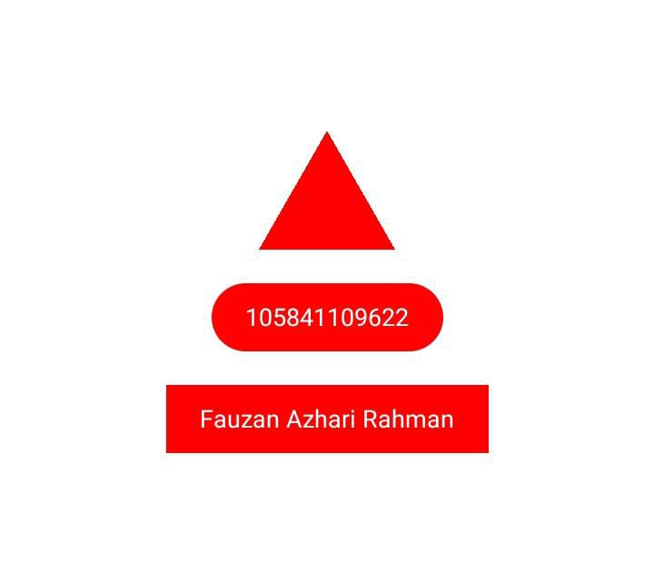

# Tugas React Native 1 - Bentuk Geometri

Proyek ini adalah aplikasi React Native sederhana yang menampilkan tiga bentuk geometri dasar: **segitiga**, **persegi panjang**, dan **bentuk kapsul (pil)**, masing-masing dengan penyesuaian gaya dan teks tertentu.

## Preview

Aplikasi ini akan menampilkan tampilan seperti berikut:



---

## Fitur Utama

* **Segitiga**: Sebuah bentuk segitiga standar berwarna **peach**.
* **Persegi Panjang**: Kotak persegi panjang berwarna **maroon** yang secara otomatis menyesuaikan lebarnya dengan panjang teks nama di dalamnya.
* **Bentuk Pil (Capsule)**: Sebuah bentuk menyerupai kapsul berwarna **sky blue** yang menampilkan Stambuk/NIM.
* **Font Kustom**: Menggunakan font kustom "**NothingYouCouldDo-Regular**" dari file `.ttf` yang dimuat secara asinkron.
* **Desain Bersih**: Menggunakan gaya visual yang rapi dan kontras warna yang baik untuk keterbacaan.

---

## Struktur Proyek
expo-farr/

├── assets/

│   ├── fonts/

│   │   └── NothingYouCouldDo-Regular.ttf

│   └── images/

│       └── hasil.png

├── app/

│   ├── _layout.tsx

│   └── index.tsx

├── package.json

├── babel.config.js

└── scripts/

└── reset-project.js

---

## Persyaratan

Pastikan Anda telah menginstal:

* **Node.js** (disarankan versi LTS)
* **npm** (Node Package Manager) atau **Yarn**
* **Expo CLI**: Jika belum, instal secara global:
    ```bash
    npm install -g expo-cli
    ```
    Atau gunakan `npx` (direkomendasikan) tanpa instalasi global:
    ```bash
    npx expo
    ```

---

## Instalasi

Ikuti langkah-langkah berikut untuk mengatur proyek Anda:

1.  **Clone repositori ini** 
    ```bash
    git clone https://github.com/dzikriinzl/TGS1-AKB
    ```
2.  **Navigasi ke direktori proyek**:
    ```bash
    cd expo-farr
    ```
3.  **Instal semua dependensi**:
    ```bash
    npm install
    # atau jika Anda menggunakan Yarn:
    yarn install
    ```

---

## Menjalankan Aplikasi

Setelah semua dependensi terinstal, Anda dapat menjalankan aplikasi menggunakan perintah berikut:

```bash
npx expo start